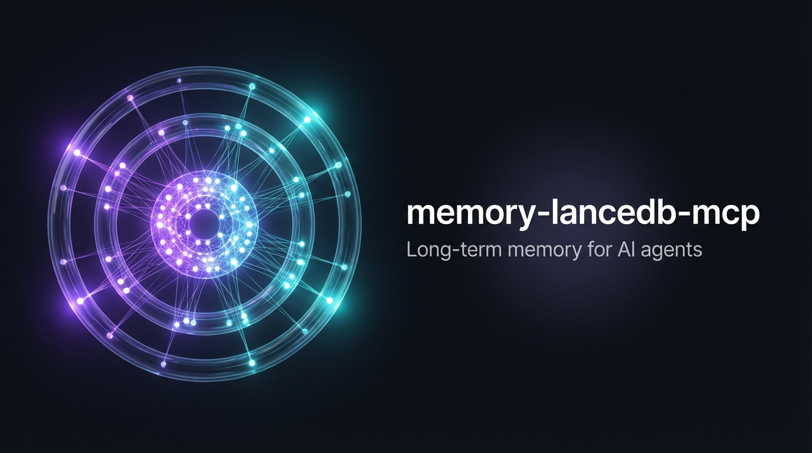

<div align="center">



**為任何 MCP 相容 AI Agent 提供持久化、智慧化的長期記憶。**

[](https://www.npmjs.com/package/@cablate/memory-lancedb-mcp)
[](https://www.npmjs.com/package/@cablate/memory-lancedb-mcp)
[](https://lancedb.com)
[](LICENSE)

[English](README.md) | **繁體中文**

</div>

---

## 裝了之後差在哪

沒有記憶，每次對話從零開始。有了 memory-lancedb-mcp，Agent 跨 session 自動累積知識。

**Before** — Agent 沒有上下文：
```
使用者：「用跟上次一樣的動畫風格」
Agent：「我沒有之前動畫的相關資訊，可以描述一下你想要的效果嗎？」
```

**After** — Agent 回憶過去的決策：
```xml
<memories>
1. Remotion spring 動畫：duration >= 20，damping 12-15 可獲得平滑緩動
2. 影片輸出預設：社群用 1080p 30fps，demo 用 60fps
</memories>
<refs>#1=6352a7d2 #2=bed148f0</refs>
```

Store 回傳極簡——沒有噪音，只有確認：
```
Stored. [topic: remotion]
```

---

## 快速開始

### 1. 安裝

```bash
npm install -g @cablate/memory-lancedb-mcp
```

### 2. 設定

加入 MCP 客戶端設定（如 Claude Desktop 的 `claude_desktop_config.json`）：

```json
{
  "mcpServers": {
    "memory": {
      "command": "npx",
      "args": ["-y", "@cablate/memory-lancedb-mcp"],
      "env": {
        "EMBEDDING_API_KEY": "your-api-key",
        "EMBEDDING_MODEL": "text-embedding-3-small"
      }
    }
  }
}
```

<details>
<summary><strong>進階：使用設定檔完整控制</strong></summary>

```json
{
  "mcpServers": {
    "memory": {
      "command": "npx",
      "args": ["-y", "@cablate/memory-lancedb-mcp"],
      "env": {
        "MEMORY_LANCEDB_CONFIG": "/path/to/config.json"
      }
    }
  }
}
```

詳見 [config.example.json](config.example.json)。

</details>

---

## 運作原理

```
          store                          recall
            │                              │
   ┌────────▼────────┐           ┌────────▼────────┐
   │  過濾垃圾訊息    │           │ 同時搜語意和關鍵字 │
   │  儲存 + 向量化   │           │ 重新排序結果      │
   │  自動連結相關記憶 │           │ 淡化過時的記憶    │
   │  標記矛盾        │           │ 拉進關聯記憶      │
   │  標註主題        │           │ 合併重複          │
   └────────┬────────┘           └────────┬────────┘
            │                             │
            ▼                             ▼
   ┌─────────────────────────────────────────────┐
   │          LanceDB（本地、零設定）              │
   └─────────────────────────────────────────────┘
```

每次 `memory_store` 存入本地資料庫，自動連結相關記憶、標記矛盾、推導主題標籤——不需額外 API 呼叫。每次 `memory_recall` 同時用語意和關鍵字搜尋，拉進主搜尋可能遺漏的關聯記憶，並附帶維護提示讓 Agent 能自我維護知識庫。

---

## 功能特性

### 檢索

- **換個說法也找得到** — 同時搜尋語意和精確關鍵字，取兩者最好的結果
- **結果更精準，不只是表面匹配** — 可選的第二輪重排序，依實際相關性排列（支援 6 家供應商）
- **一次搜多個主題** — 傳入 `queries` 陣列，一次搜多個關鍵字；結果自動去重，命中多個查詢的記憶排更前面
- **找到 A 自動帶出相關的 B** — 找到一筆記憶時，連帶拉出它的關聯記憶，即使用詞完全不同
- **省 Token** — 回傳用精簡的 XML 標籤（`<memories>`、`<hints>`、`<refs>`），ID 壓縮成短碼，不帶多餘的分類/範圍資訊

### 儲存

- **相關記憶自動連結** — 存入新記憶時，自動和相似的既有記憶建立雙向連結
- **矛盾會被標記** — 新記憶和現有記憶衝突時會發出警告，不會靜默覆蓋
- **主題自動標註** — 每筆記憶會從內容和鄰居推導主題標籤；也可以手動指定
- **垃圾自動過濾** — 問候語、拒絕回覆、後設問題在存入前就被擋下

### 生命週期

- **常用的記憶保持鮮明，不用的逐漸淡出** — 衰減模型綜合考量多近期、多常存取、多重要
- **記憶靠使用量升級** — 三層（邊緣 → 工作 → 核心），越常被存取升級越快
- **完整版本歷史** — 更新記憶時舊版保留在版本鏈裡，用 `memory_history` 可以追溯

### 維護

- **Agent 自己維護** — 每次 recall 結果裡會附帶提示：哪些記憶重複、哪些太久沒用、哪些互相矛盾
- **隨時健康檢查** — `memory_lint` 找出孤兒記憶、過期條目、缺失連結，能修的自動修
- **合併重複** — `memory_merge` 把兩筆重複記憶合成一筆，原始的標記為已取代
- **視覺化你的記憶空間** — `memory_visualize` 產生互動式 HTML 圖譜，瀏覽器打開就能看

---

## 視覺化

執行 `memory_visualize` 產生互動式記憶知識圖譜：

- 自動聚類——相關記憶在視覺上群聚在一起
- 相似度連線、重複偵測、重要性大小
- 時間篩選、成長動畫、聚類檢視
- 獨立 HTML 檔——任何瀏覽器開啟即可

---

<details>
<summary><strong>評分管線（技術細節）</strong></summary>

```
Query → embedQuery() ─┐
                       ├─→ RRF 融合 → 重排序 → 生命週期衰減 → 長度正規化 → 過濾
Query → BM25 FTS ─────┘
```

| 階段 | 效果 |
|------|------|
| **RRF 融合** | 結合語意與精確匹配召回 |
| **Cross-Encoder 重排序** | 提升語意精確度高的結果 |
| **生命週期衰減** | Weibull 新鮮度 + 存取頻率 + 重要性 |
| **長度正規化** | 防止長條目主導排名（錨點：500 字元） |
| **最低分數門檻** | 移除不相關結果（預設：0.35） |
| **MMR 多樣性** | 餘弦相似度 > 0.85 → 降權 |

</details>

---

## 設定

### 環境變數

| 變數 | 必填 | 說明 |
|------|------|------|
| `EMBEDDING_API_KEY` | 是 | Embedding 供應商的 API Key |
| `EMBEDDING_MODEL` | 否 | 模型名稱（預設：`text-embedding-3-small`） |
| `EMBEDDING_BASE_URL` | 否 | 非 OpenAI 供應商的自訂 Base URL |
| `MEMORY_DB_PATH` | 否 | LanceDB 儲存目錄 |
| `MEMORY_LANCEDB_CONFIG` | 否 | JSON 設定檔路徑 |

<details>
<summary><strong>完整設定範例</strong></summary>

```json
{
  "embedding": {
    "apiKey": "${EMBEDDING_API_KEY}",
    "model": "jina-embeddings-v5-text-small",
    "baseURL": "https://api.jina.ai/v1",
    "dimensions": 1024,
    "taskQuery": "retrieval.query",
    "taskPassage": "retrieval.passage",
    "normalized": true
  },
  "dbPath": "./memory-data",
  "retrieval": {
    "mode": "hybrid",
    "vectorWeight": 0.7,
    "bm25Weight": 0.3,
    "minScore": 0.3,
    "rerank": "cross-encoder",
    "rerankApiKey": "${JINA_API_KEY}",
    "rerankModel": "jina-reranker-v3",
    "rerankEndpoint": "https://api.jina.ai/v1/rerank",
    "rerankProvider": "jina",
    "candidatePoolSize": 20,
    "hardMinScore": 0.35,
    "filterNoise": true
  },
  "enableManagementTools": true,
  "enableSelfImprovementTools": false,
  "enableVisualizationTools": true,
  "scopes": {
    "default": "global",
    "definitions": {
      "global": { "description": "Shared knowledge" },
      "agent:my-bot": { "description": "Private to my-bot" }
    },
    "agentAccess": {
      "my-bot": ["global", "agent:my-bot"]
    }
  },
  "decay": {
    "recencyHalfLifeDays": 30,
    "frequencyWeight": 0.3,
    "intrinsicWeight": 0.3
  }
}
```

</details>

<details>
<summary><strong>Embedding 供應商</strong></summary>

支援**任何 OpenAI 相容的 embedding API**：

| 供應商 | 模型 | Base URL | 維度 |
|--------|------|----------|------|
| **OpenAI** | `text-embedding-3-small` | `https://api.openai.com/v1` | 1536 |
| **Jina** | `jina-embeddings-v5-text-small` | `https://api.jina.ai/v1` | 1024 |
| **DeepInfra** | `Qwen/Qwen3-Embedding-8B` | `https://api.deepinfra.com/v1/openai` | 1024 |
| **Google Gemini** | `gemini-embedding-001` | `https://generativelanguage.googleapis.com/v1beta/openai/` | 3072 |
| **Ollama**（本地） | `nomic-embed-text` | `http://localhost:11434/v1` | _視模型而定_ |

</details>

<details>
<summary><strong>Rerank 供應商</strong></summary>

| 供應商 | `rerankProvider` | Endpoint | 範例模型 |
|--------|-----------------|----------|----------|
| **Jina** | `jina` | `https://api.jina.ai/v1/rerank` | `jina-reranker-v3` |
| **Hugging Face TEI** | `tei` | `http://host:8081/rerank` | `BAAI/bge-reranker-v2-m3` |
| **SiliconFlow** | `siliconflow` | `https://api.siliconflow.com/v1/rerank` | `BAAI/bge-reranker-v2-m3` |
| **Voyage AI** | `voyage` | `https://api.voyageai.com/v1/rerank` | `rerank-2.5` |
| **Pinecone** | `pinecone` | `https://api.pinecone.io/rerank` | `bge-reranker-v2-m3` |
| **DashScope** | `dashscope` | `https://dashscope.aliyuncs.com/api/v1/services/rerank` | `gte-rerank` |

</details>

---

<details>
<summary><strong>工具參考</strong></summary>

### 核心工具

| 工具 | 說明 |
|------|------|
| `memory_recall` | 搜尋記憶——支援批次查詢、關聯展開、主題過濾、維護提示 |
| `memory_store` | 儲存記憶——自動連結、矛盾偵測、主題推導、垃圾過濾 |
| `memory_forget` | 依 ID 或搜尋查詢刪除 |
| `memory_update` | 更新記憶，舊版保留在版本鏈裡 |
| `memory_merge` | 合併兩條記憶為一條 |
| `memory_history` | 追蹤更新/合併的版本歷史 |

### 管理工具（需啟用）

| 工具 | 說明 |
|------|------|
| `memory_stats` | 依 scope 與 category 統計用量 |
| `memory_list` | 列出近期記憶，支援過濾 |
| `memory_lint` | 健康檢查 + 自動修復缺失關聯 |

啟用：`"enableManagementTools": true`

### 自我改進工具（預設關閉）

| 工具 | 說明 |
|------|------|
| `self_improvement_log` | 記錄結構化學習/錯誤條目 |
| `self_improvement_extract_skill` | 從學習條目建立 Skill 骨架 |
| `self_improvement_review` | 彙總治理積壓狀況 |

啟用：`"enableSelfImprovementTools": true`

### 視覺化工具（預設啟用）

| 工具 | 說明 |
|------|------|
| `memory_visualize` | 產生互動式 HTML 記憶圖譜 |

參數：`output_path`、`scope`、`threshold`（預設 0.65）、`max_neighbors`（預設 4）

關閉：`"enableVisualizationTools": false`

</details>

---

<details>
<summary><strong>資料庫結構</strong></summary>

LanceDB 資料表 `memories`：

| 欄位 | 類型 | 說明 |
|------|------|------|
| `id` | string (UUID) | 主鍵 |
| `text` | string | 記憶文字（FTS 索引） |
| `vector` | float[] | Embedding 向量 |
| `category` | string | `preference` / `fact` / `decision` / `entity` / `skill` / `lesson` / `other` |
| `scope` | string | Scope 識別碼 |
| `importance` | float | 重要性分數 0-1 |
| `timestamp` | int64 | 建立時間戳（毫秒） |
| `metadata` | string (JSON) | 擴充元資料（tier、access_count、relations、topic 等） |

</details>

---

## 開發

```bash
git clone https://github.com/cablate/memory-lancedb-mcp.git
cd memory-lancedb-mcp
npm install
npm test
```

本地執行：

```bash
EMBEDDING_API_KEY=your-key npx tsx server.ts
```

---

## 致謝

基於 [CortexReach/memory-lancedb-pro](https://github.com/CortexReach/memory-lancedb-pro) — 原作者 [win4r](https://github.com/win4r) 及貢獻者們。

## 授權

MIT — 詳見 [LICENSE](LICENSE)。
